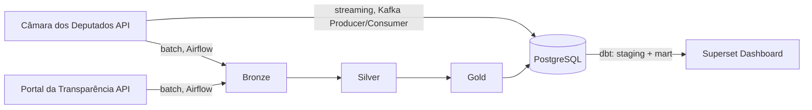

# GovTrack BR


Pipeline de dados que reúne e processa informações públicas do governo federal brasileiro, unindo dados de deputados federais e emendas parlamentares numa arquitetura de Data Lakehouse em camadas (Medallion).

## Dashboard


Dashboard construído no Apache Superset, sobre as tabelas do PostgreSQL, mostrando os 513 deputados federais por partido/estado e o total de emendas parlamentares pagas por função (`SUM(valorpago)`).

## Fontes de dados

- **[Câmara dos Deputados](https://dadosabertos.camara.leg.br/)** — API REST com dados de todos os deputados federais em exercício.
- **[Portal da Transparência](https://portaldatransparencia.gov.br/api-de-dados)** — API com emendas parlamentares e valores pagos, paginada.

## Arquitetura

```
Fontes (Câmara / Portal da Transparência)
            │
            │  batch, Airflow            streaming, Kafka
            ▼                                  │
+---------------------------+                  │
|          BRONZE           |                  │
|  deputados.parquet        |                  │
|  emendas.parquet          |                  │
|  (dados brutos das APIs)  |                  │
+-------------+-------------+                  │
              │ limpeza, tipagem, seleção       │
              ▼ de colunas                      │
+---------------------------+                   │
|          SILVER           |                   │
|  deputados.parquet        |                   │
|  emendas.parquet          |                   │
|  (dados normalizados)     |                   │
+-------------+-------------+                   │
              │ agregações                      │
              ▼                                 │
+---------------------------+                   │
|           GOLD            |                   │
|  deputados_por_partido    |                   │
|  emendas por função/ano   |                   │
+-------------+-------------+                   │
              │                                 │
              ▼                                 ▼
+-----------------------------------------------+
|                   PostgreSQL                   |
|   (tabela deputados: seed dbt + pipeline)      |
+---------------------------+--------------------+
                             │ dbt: staging → mart
                             ▼
                  +-----------------------+
                  |    Apache Superset     |
                  |       Dashboard        |
                  +-----------------------+
```

Também é possível representar o mesmo fluxo em Mermaid:



## Camadas do Data Lake (Medallion)

O pipeline segue a arquitetura Medallion, com cada camada em Parquet gerado via Pandas/PyArrow:

- **Bronze** — cópia fiel do retorno das APIs (Câmara e Portal da Transparência), sem transformação, em `data/bronze/*.parquet`. Serve como histórico bruto e ponto de reprocessamento caso a lógica de Silver/Gold mude.
- **Silver** — seleção das colunas relevantes, normalização de tipos (ex.: conversão de `valorPago` de string em formato BR para `float`) e checagem básica de qualidade (nulos, duplicados, dtypes) impressa no log da task. Grava em `data/silver/*.parquet`.
- **Gold** — agregações prontas para consumo: total de deputados por partido (`groupby siglaPartido`) e soma de emendas pagas por ano/tipo/localidade do gasto. Grava em `data/gold/*.parquet`.

A camada Silver de deputados é a que alimenta o PostgreSQL (via `popular_banco.py`), que por sua vez é a fonte dos modelos dbt e do dashboard — ou seja, o dbt não lê os Parquet diretamente, e sim os dados já carregados no banco (seed de deputados + tabela populada pelo pipeline/consumer).

## Stack

| Tecnologia | Função |
|---|---|
| Python | Ingestão e transformação de dados |
| Apache Airflow | Orquestração do pipeline (DAG `pipeline_deputados`) |
| Apache Kafka | Streaming de deputados em tempo real (producer/consumer) |
| PostgreSQL | Armazenamento relacional (tabela `deputados`, schema dos modelos dbt) |
| dbt | Staging, modelo mart e testes de qualidade sobre os dados de deputados |
| Apache Superset | Dashboard interativo |
| Docker / Docker Compose | Containerização de toda a infraestrutura |
| GitHub Actions | CI/CD — roda `dbt seed`, `dbt run` e `dbt test` a cada push/PR na `main` |
| Pandas + PyArrow | Processamento e leitura/escrita em Parquet |

## Streaming com Kafka

Como caminho alternativo ao pipeline batch do Airflow, os deputados também podem ser publicados em tempo real no topic `deputados` via Producer e consumidos por um Consumer que insere diretamente no PostgreSQL (`ON CONFLICT (id) DO NOTHING`), sem passar pelas camadas Bronze/Silver/Gold.

```bash
# Publicar deputados no Kafka
python3 src/ingestion/kafka_producer.py

# Consumir e inserir no banco
python3 src/ingestion/kafka_consumer.py
```

## Transformações com dbt

O projeto `govtrack_dbt` contém:

- **Seed** (`seeds/deputados.csv`) — snapshot dos dados de deputados, carregado com `dbt seed` (usado tanto localmente quanto no CI, que não depende de credenciais de API externas).
- **Staging** (`models/staging/stg_deputados.sql`) — normaliza nomes de coluna e filtra registros sem nome.
- **Mart** (`models/mart/mart_deputados_por_partido.sql`) — total de deputados por partido, agregado a partir da staging.
- **Testes de schema** (`models/staging/schema.yml`) — `not_null` e `unique` nos campos-chave de `stg_deputados` e `mart_deputados_por_partido`.

## CI/CD

O workflow `.github/workflows/dbt_test.yml` sobe um serviço PostgreSQL efêmero e, a cada push ou pull request na branch `main`, executa `dbt seed`, `dbt run` e `dbt test` contra ele. Se algum teste de schema falhar, o pipeline fica vermelho.

## Como rodar localmente

Pré-requisitos: Docker e Docker Compose.

```bash
git clone https://github.com/vitorsilvestre29/govtrack-br
cd govtrack-br
cp .env.example .env  # preencha DB_PASSWORD, AIRFLOW_DB_PASSWORD, SUPERSET_SECRET_KEY e PORTAL_TRANSPARENCIA_API_KEY
docker compose up -d
```

Isso sobe PostgreSQL (app e Airflow), Airflow webserver/scheduler, Superset, Zookeeper e Kafka. O Airflow fica disponível em `localhost:8081` e o Adminer (cliente web do Postgres) em `localhost:8080`.

### Inicializar o Superset

```bash
docker exec -it govtrack-br-superset-1 superset db upgrade
docker exec -it govtrack-br-superset-1 superset fab create-admin \
  --username admin --firstname Admin --lastname Admin \
  --email admin@govtrack.com --password <sua-senha>
docker exec -it govtrack-br-superset-1 superset init
```

Acesse `localhost:8088` com o usuário e senha definidos no passo acima.

### Rodar os modelos dbt

```bash
cd govtrack_dbt
dbt seed
dbt run
dbt test
```

Os comandos usam `profiles.yml` do próprio projeto (`DBT_PROFILES_DIR=.`), configurado para o PostgreSQL local.

### Scripts de ingestão/transformação fora do Airflow

Os módulos em `src/ingestion` e `src/transformation` também podem ser executados diretamente (o Airflow apenas os orquestra via `PythonOperator`), desde que as dependências deles — `pandas`, `pyarrow`, `psycopg2`, `requests` e, para o streaming, `kafka-python` — estejam instaladas no ambiente Python local.

## Estrutura do repositório

```
dags/                DAG do Airflow (pipeline_deputados)
src/ingestion/        Coleta das APIs, Bronze, Kafka producer/consumer, conexão com o banco
src/transformation/    Transformações Silver e Gold (deputados e emendas)
govtrack_dbt/          Projeto dbt (seeds, staging, mart, testes)
.github/workflows/     CI (dbt seed/run/test)
docker-compose.yml     Orquestração de toda a infraestrutura
```
