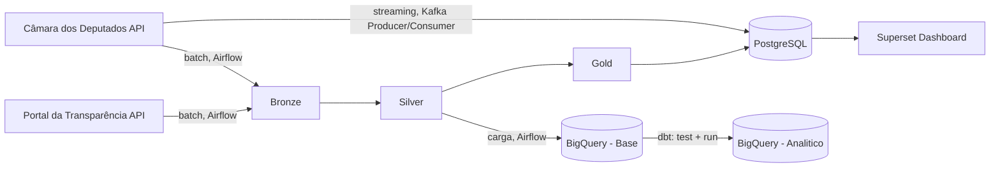

# GovTrack BR


Pipeline de dados que reúne e processa informações públicas do governo federal brasileiro: deputados federais e emendas parlamentares. Os dados passam por camadas em Parquet (Medallion), são carregados no BigQuery e modelados com dbt em um esquema estrela (fato + dimensões).

## Dashboard


Dashboard construído no Apache Superset, sobre as tabelas do PostgreSQL, mostrando os 513 deputados federais por partido/estado e o total de emendas parlamentares pagas por função (`SUM(valorpago)`).

## Fontes de dados

- **[Câmara dos Deputados](https://dadosabertos.camara.leg.br/)**: API REST com dados de todos os deputados federais em exercício.
- **[Portal da Transparência](https://portaldatransparencia.gov.br/api-de-dados)**: API com emendas parlamentares e valores pagos, paginada.

## Arquitetura

```
Fontes (Câmara / Portal da Transparência)
            │
            │  batch, Airflow            streaming, Kafka
            ▼                                  │
+---------------------------+                  │
|          BRONZE           |                  │
|  deputados.parquet        |                  │
|  emendas.parquet          |                  │
|  (dados brutos das APIs)  |                  │
+-------------+-------------+                  │
              │ limpeza, tipagem, seleção       │
              ▼ de colunas                      │
+---------------------------+                   │
|          SILVER           |                   │
|  deputados.parquet        |──► BigQuery       │
|  emendas.parquet          |   GovTrackBr_Base │
|  (dados normalizados)     |   deputados_bruto │
|                           |   emendas_bruto   │
+-------------+-------------+                   │
              │                                 │
              ▼ dbt: test → run                 │
+-----------------------------------------------+
|   BigQuery (GovTrackBr_Analitico)             |
|   stg_deputados, stg_emendas                  |
|   mart_deputados_por_partido                  |
|   dim_autor, dim_funcao, dim_localidade       |
|   fato_emendas                                |
+-----------------------------------------------+
              │
              ▼
+---------------------------+                   │
|           GOLD            |                   │
|  deputados_por_partido    |                   │
|  emendas por função/ano   |                   │
+-------------+-------------+                   │
              │                                 │
              ▼                                 ▼
+-----------------------------------------------+
|                   PostgreSQL                  |
|   (tabela deputados + emendas, via pipeline)  |
+---------------------------+-------------------+
                            │
                            ▼
                 +-----------------------+
                 |    Apache Superset    |
                 |       Dashboard       |
                 +-----------------------+
```

Também é possível representar o mesmo fluxo em Mermaid:


```mermaid
flowchart LR
    A[Câmara dos Deputados API] -->|batch, Airflow| B[Bronze]
    A -->|streaming, Kafka Producer/Consumer| F[(PostgreSQL)]
    C[Portal da Transparência API] -->|batch, Airflow| B
    B --> D[Silver]
    D -->|carga, Airflow| H[(BigQuery - Base)]
    H -->|dbt: test + run| I[(BigQuery - Analitico)]
    D --> E[Gold]
    E --> F
    F --> G[Superset Dashboard]
```

## Camadas do Data Lake (Medallion)

O pipeline segue a arquitetura Medallion, com cada camada em Parquet gerado via Pandas/PyArrow:

- **Bronze**: cópia fiel do retorno das APIs (Câmara e Portal da Transparência), sem transformação, em `data/bronze/*.parquet`. Serve como histórico bruto e ponto de reprocessamento caso a lógica de Silver/Gold mude.
- **Silver**: seleção das colunas relevantes, normalização de tipos (ex.: conversão de `valorPago` de string em formato BR para `float`) e checagem básica de qualidade (nulos, duplicados, dtypes) impressa no log da task. Grava em `data/silver/*.parquet`.
- **Gold**: agregações prontas para consumo: total de deputados por partido (`groupby siglaPartido`) e soma de emendas pagas por ano/tipo/localidade do gasto. Grava em `data/gold/*.parquet`.

Além dos Parquet, as duas Silver são carregadas no BigQuery, no dataset `GovTrackBr_Base`, com `WRITE_TRUNCATE`:

- `deputados_bruto` (513 linhas), pelo módulo `src/ingestion/silver_bigquery.py`.
- `emendas_bruto` (75 linhas), pelo módulo `src/ingestion/silver_bigquery_emendas.py`.

A partir dessas tabelas, o dbt cria os modelos de `GovTrackBr_Analitico`. A Gold e a tabela `deputados` do PostgreSQL continuam sendo a fonte do dashboard no Superset.

## Stack

| Tecnologia | Função |
|---|---|
| Python | Ingestão e transformação de dados |
| Apache Airflow | Orquestração do pipeline (DAG `pipeline_deputados`) |
| Apache Kafka | Streaming de deputados em tempo real (producer/consumer) |
| PostgreSQL | Armazenamento relacional usado pelo dashboard (tabela `deputados`, emendas) |
| BigQuery | Data warehouse: `GovTrackBr_Base` (dado bruto da Silver) e `GovTrackBr_Analitico` (modelos dbt) |
| dbt | Staging, dimensões, fato, mart e testes de qualidade |
| Apache Superset | Dashboard interativo |
| Docker / Docker Compose | Containerização de toda a infraestrutura |
| GitHub Actions | CI: roda `dbt parse` a cada push/PR na `main` |
| Pandas + PyArrow | Processamento e leitura/escrita em Parquet |

## Pipeline do Airflow

A DAG `pipeline_deputados` roda diariamente (`@daily`) e tem duas cadeias.

Deputados:

```
salvar_bronze → transformar_silver → salvar_silver_bigquery
  → tarefa_bash_teste (dbt test) → tarefa_bash (dbt run)
  → transformar_gold → popular_banco
```

Emendas:

```
salvar_bronze_emendas → emendas_silver → salvar_silver_emendas_bigquery
  → emendas_gold
```

- `tarefa_bash_teste` roda `dbt test` antes de `dbt run`. Se um teste falhar, a tarefa fica vermelha e as views não são recriadas.
- As duas cadeias rodam em paralelo. A de emendas carrega o BigQuery, mas o `dbt` ainda não roda para ela no Airflow: os modelos de emendas são executados manualmente (ver "Rodar os modelos dbt").

## Streaming com Kafka

Como caminho alternativo ao pipeline batch do Airflow, os deputados também podem ser publicados em tempo real no topic `deputados` via Producer e consumidos por um Consumer que insere diretamente no PostgreSQL (`ON CONFLICT (id) DO NOTHING`), sem passar pelas camadas Bronze/Silver/Gold.

```bash
# Publicar deputados no Kafka
python3 src/ingestion/kafka_producer.py

# Consumir e inserir no banco
python3 src/ingestion/kafka_consumer.py
```

## Transformações com dbt

O projeto `govtrack_dbt` modela os dados de deputados e emendas em um esquema estrela: uma fato de emendas cercada por três dimensões.

### Fontes

Definidas em `models/staging/schema.yml`:

- `GovTrackBr_Base.deputados_bruto`
- `GovTrackBr_Base.emendas_bruto`

### Staging (views)

- `stg_deputados`: normaliza nomes de colunas (`siglaPartido` → `siglapartido`, etc.) e filtra registros sem nome.
- `stg_emendas`: seleciona as colunas de emendas (`codigoEmenda`, `ano`, `tipoEmenda`, `autor`, `localidadeDoGasto`, `funcao`, `valorPago`), sem filtro.

### Mart (views)

- `mart_deputados_por_partido`: total de deputados por partido, agregado a partir de `stg_deputados`.
- `dim_autor`: uma linha por autor distinto, com o tipo do autor classificado pelo nome: Comissão, Bancada, Relator, Sem informação ou Outro.
- `dim_funcao`: uma linha por função distinta (ex.: Saúde, Urbanismo).
- `dim_localidade`: uma linha por localidade distinta do gasto.
- `fato_emendas`: uma linha por emenda, com `codigoEmenda`, `autor`, `funcao`, `localidadeDoGasto` e a medida `valorPago`. O `ano` fica como atributo, já que não há necessidade de uma dimensão de tempo com os dados atuais.

### Testes

- `not_null` e `unique` nos campos-chave de `stg_deputados` e `mart_deputados_por_partido`.
- `relationships` na `fato_emendas`: cada `autor`, `funcao` e `localidadeDoGasto` precisa existir na dimensão correspondente.

Documentação dos modelos (`description`) está em `models/staging/schema.yml` e `models/mart/schema.yml`. Para visualizar, rode `dbt docs generate` e `dbt docs serve`.

### Limitações conhecidas

- `codigoEmenda` não identifica cada linha: alguns registros têm `S/I` ou `REL. GERAL` como código. Por isso ele não tem teste `unique` e a fato não tem chave própria.
- `dim_autor` classifica comissões pelo trecho do nome (`%COM%`), e a comparação é sensível a maiúsculas. Comissões com nomes diferentes podem aparecer como valores distintos (ex.: "COMISSAO DE FINANCAS E TRIBUTACAO - CFT" e "COM. FINANCAS E TRIBUTACAO"). Ainda não existe uma coluna de nome padronizado.

## CI/CD

O workflow `.github/workflows/dbt_test.yml` roda `dbt parse` a cada push ou pull request na branch `main`. Ele valida que o projeto dbt está bem formado (modelos, sources e YAML), mas não conecta no BigQuery, porque o CI não tem credenciais. Os testes de dados rodam no Airflow, onde a credencial já existe.

## Como rodar localmente

Pré-requisitos: Docker e Docker Compose, e uma conta Google Cloud com acesso ao projeto `govtrackbr`.

```bash
git clone https://github.com/vitorsilvestre29/govtrack-br
cd govtrack-br
cp .env.example .env  # preencha DB_PASSWORD, AIRFLOW_DB_PASSWORD, SUPERSET_SECRET_KEY e PORTAL_TRANSPARENCIA_API_KEY
gcloud auth application-default login
docker compose up -d
```

O `gcloud auth application-default login` gera o arquivo de credencial que os containers do Airflow montam via volume. Sem ele, a carga para o BigQuery e o `dbt` falham com `DefaultCredentialsError`.

Isso sobe PostgreSQL (app e Airflow), Airflow webserver/scheduler, Superset, Zookeeper e Kafka. O Airflow fica disponível em `localhost:8081` e o Adminer (cliente web do Postgres) em `localhost:8080`.

### Versões do dbt

- No Airflow (container com Python 3.7), o `docker-compose.yml` instala `dbt-bigquery==1.5.0` via `_PIP_ADDITIONAL_REQUIREMENTS`.
- No CI, `dbt parse` roda com `dbt-bigquery==1.8.0`.

### Inicializar o Superset

```bash
docker exec -it govtrack-br-superset-1 superset db upgrade
docker exec -it govtrack-br-superset-1 superset fab create-admin \
  --username admin --firstname Admin --lastname Admin \
  --email admin@govtrack.com --password <sua-senha>
docker exec -it govtrack-br-superset-1 superset init
```

Acesse `localhost:8088` com o usuário e senha definidos no passo acima.

### Rodar os modelos dbt

Pré-requisito: ADC configurado na sua máquina com `gcloud auth application-default login`.

```bash
cd govtrack_dbt
dbt run --profiles-dir .
dbt test --profiles-dir .
```

Os comandos usam o `profiles.yml` do próprio projeto (`--profiles-dir .`), configurado para o BigQuery (projeto `govtrackbr`, dataset `GovTrackBr_Analitico`, autenticação por `oauth`).

### Scripts de ingestão/transformação fora do Airflow

Os módulos em `src/ingestion` e `src/transformation` também podem ser executados diretamente (o Airflow apenas os orquestra via `PythonOperator`), desde que as dependências deles (`pandas`, `pyarrow`, `psycopg2`, `requests`, `google-cloud-bigquery` e, para o streaming, `kafka-python`) estejam instaladas no ambiente Python local.

## Estrutura do repositório

```
dags/                  DAG do Airflow (pipeline_deputados)
src/ingestion/         Coleta das APIs, Bronze, carga para BigQuery (deputados e emendas), Kafka producer/consumer, conexão com o banco
src/transformation/    Transformações Silver e Gold (deputados e emendas)
govtrack_dbt/          Projeto dbt (sources, staging, dimensões, fato, mart, testes)
.github/workflows/     CI (dbt parse)
docker-compose.yml     Orquestração de toda a infraestrutura
```
